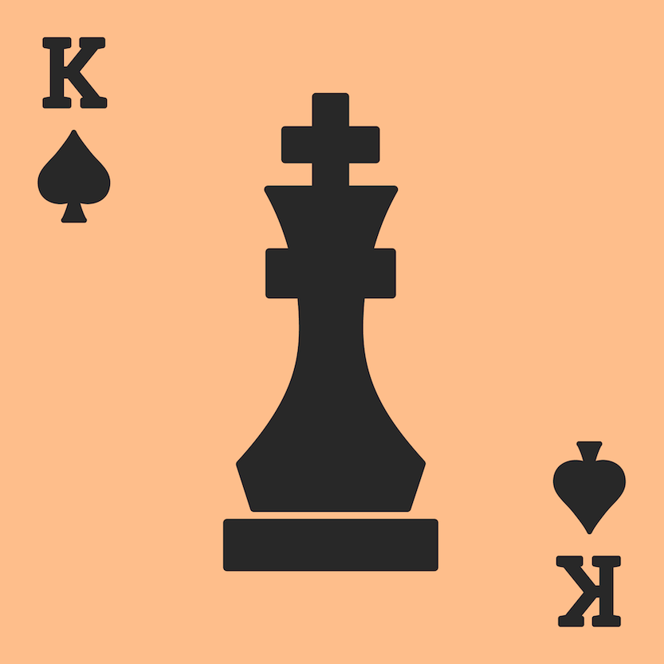

# Chessao

[](https://travis-ci.org/tadeoos/chessao)
[](https://coveralls.io/github/tadeoos/chessao)

<!--  -->

Combination of Chess and [Mao](https://en.wikipedia.org/wiki/Mao_(card_game)).

Coming soon.


## Development

### tests

From the root directory run:

```bash
python src/tests/chessao_tests.py 1 [or other number of games]
```

Run doctests for specific module (from /src directory):

```bash
python -m doctest chessao/cards.py -v
```
