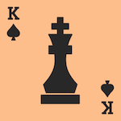

# Chessao



[](https://travis-ci.org/tadeoos/chessao)
[](https://coveralls.io/github/tadeoos/chessao)

Combination of Chess and [Macau](https://en.wikipedia.org/wiki/Mau_mau_(card_game)).

Coming soonish.


## Development

### dev server for fe

$ cd chessao 
$ export FLASK_APP=dev 
$ export FLASK_ENV=development
$ poetry run flask run

### tests

```bash
pytest
```
### TODO

- [x] 4 card
- [x] 3 card
- [ ] jack
- [x] Queen
- [x] King of spades
- [ ] King of hearts
- [x] Other kings
- [x] Ace
- [ ] stalemate
- [x] Promotion
- [ ] Tests for known corner cases
